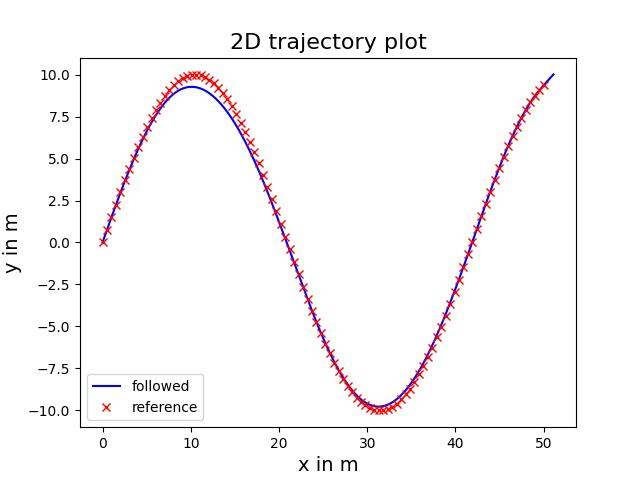
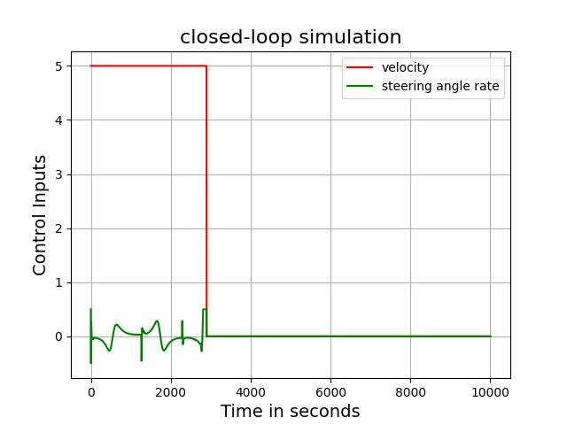

# Trajectory Tracking for Ackerman Steering using MPC and Acados

This repository implements trajectory tracking for an Ackerman steering system using **Model Predictive Control (MPC)** with the **Acados library**. The implementation focuses on tracking given reference trajectories while optimizing control inputs like steering angle and velocity.

## Table of Contents
- [Overview](#overview)
- [Features](#features)
- [Requirements](#requirements)
- [Installation](#installation)
- [Usage](#usage)
- [Results](#results)
- [References](#references)

---

## Overview

The project demonstrates:
- Designing an OCP problem for MPC controller for an Ackerman steering model.
- Using the Acados library for efficient optimization.
- Testing the controller on multiple trajectories (e.g., straight, sinusoidal paths).

---

## Features

- Trajectory tracking for various reference paths.
- Visualization of:
  - 2D trajectory plots (vehicle vs. reference path).
  - Control inputs (steering angle and velocity).
- Easily adaptable for different scenarios.

---

## Requirements

### Software:
- Python 3.x
- [Acados](https://github.com/acados/acados) library
- NumPy
- Matplotlib
- CasADi

### Installation:
Install required Python libraries with:
```bash
pip install numpy matplotlib casadi
```

---

## Usage

1. Clone the repository:
   ```bash
   git clone https://github.com/yourusername/ackerman-mpc-acados.git
   cd ackerman-mpc-acados
   ```

2. Run the main script:
   ```bash
   python main.py
   ```

3. Visualize results in the generated plots or refer to the images below.

---

## Results

Below are some sample results from the simulation:

### **2D Trajectory Plot**
Comparison of the vehicle's path with the reference trajectory.





### **Control Inputs**
Control inputs (steering angle and velocity) for three different trajectories.


### **Additional Plots**
The repository includes plots for:
- Lateral error
- Heading error
- Speed tracking

---

## References

- [Acados Documentation](https://docs.acados.org/)
- [Ackerman Steering Model](https://en.wikipedia.org/wiki/Ackermann_steering_geometry)

---

Feel free to contribute or suggest improvements! 😊
