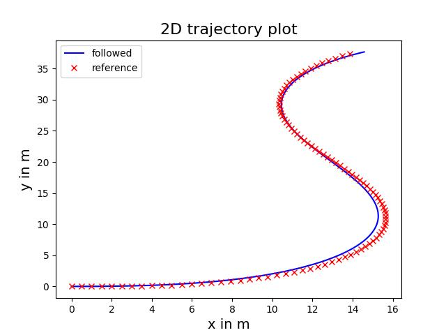
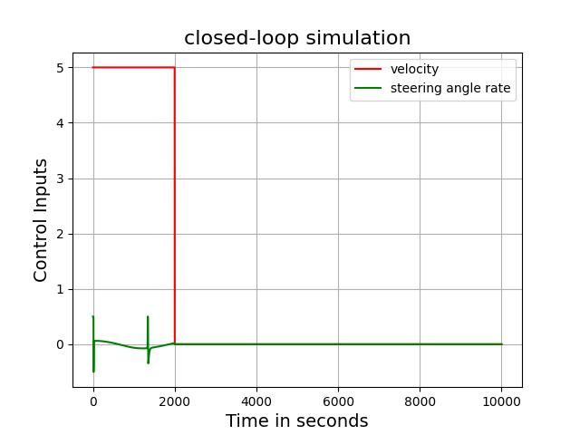
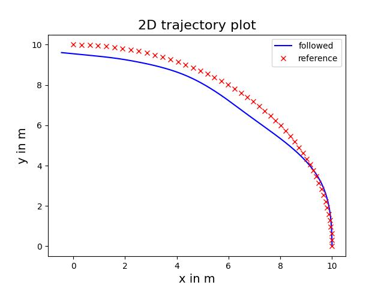
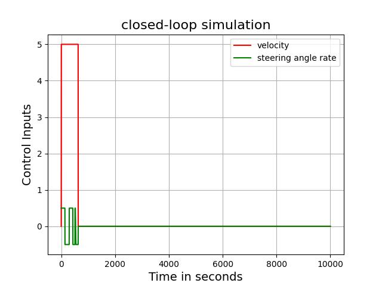

# Trajectory Tracking for Ackerman Steering using MPC and Acados

This repository implements trajectory tracking for an Ackerman steering system using **Model Predictive Control (MPC)** with the **Acados library**. The implementation focuses on tracking given reference trajectories while optimizing control inputs like steering angle and velocity.

## Table of Contents
- [Overview](#overview)
- [Features](#features)
- [Requirements](#requirements)
- [Installation](#installation)
- [Usage](#usage)
- [Results](#results)
- [References](#references)

---

## Overview

The project demonstrates:
- Designing an OCP problem for MPC controller for an Ackerman steering model.
- Using the Acados library for efficient optimization.
- Testing the controller on multiple trajectories (e.g., straight, sinusoidal paths).

---

## Features

- Trajectory tracking for various reference paths.
- Visualization of:
  - 2D trajectory plots (vehicle vs. reference path).
  - Control inputs (steering angle and velocity).
- Easily adaptable for different scenarios.

---

## Requirements

### Software:
- Python 3.x
- [Acados](https://github.com/acados/acados) library
- NumPy
- Matplotlib
- CasADi

### Installation:
Install required Python libraries with:
```bash
pip install numpy matplotlib casadi
```

---

## Usage

1. Clone the repository:
   ```bash
   git clone https://github.com/yourusername/ackerman-mpc-acados.git
   cd ackerman-mpc-acados
   ```

2. Run the main script:
   ```bash
   python main.py
   ```

3. Visualize results in the generated plots or refer to the images below.

---

## Results

Below are the results of the trajectory tracking experiments for three different reference trajectories. Each row represents a trajectory, with the 2D trajectory plot on the left and the corresponding control input plot on the right.

---

### Trajectory 1
| 2D Trajectory Plot | Control Input Plot |
|---------------------|--------------------|
|  |  |

---

### Trajectory 2
| 2D Trajectory Plot | Control Input Plot |
|---------------------|--------------------|
|  |  |

---

### Trajectory 3
| 2D Trajectory Plot | Control Input Plot |
|---------------------|--------------------|
|  |  |

---

Each plot shows the performance of the Model Predictive Controller (MPC) in tracking the desired path, while the control input plots illustrate the steering and velocity inputs used to achieve the trajectory tracking.


---

## References

- [Acados Documentation](https://docs.acados.org/)
- [Ackerman Steering Model](https://en.wikipedia.org/wiki/Ackermann_steering_geometry)

---

Feel free to contribute or suggest improvements! 😊
